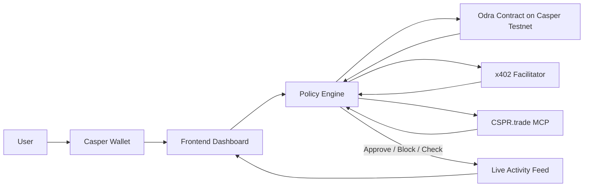

# SentryAgent

SentryAgent is a spend-policy guardrail layer for autonomous AI wallets on Casper. It sits between an agent and its wallet, enforcing hard limits before money moves: per-call spend caps, daily velocity rules, merchant allowlists, onchain approval checks, and x402-metered compliance checks for unknown endpoints. The goal is simple: let agents act fast without letting them spend recklessly.

## How It Works

1. **User connects Casper Wallet**  
   The operator connects a real Casper Wallet in the dashboard.

2. **A per-user agent wallet is generated server-side and funded by the user**  
   SentryAgent creates a dedicated agent wallet for that user, keeps the private key server-side, and shows the public address in the UI. The user then funds it with a real Casper transaction from their connected wallet.

3. **User sets policy**  
   The operator edits three core rules inline:
   - per-call cap
   - daily spend limit
   - daily call count

4. **Agent attempts payments; SentryAgent checks them against policy and against a real deployed contract onchain**  
   Mock agent requests stream into the dashboard. Each request is evaluated locally first, then the real spend-guardrail contract on Casper testnet is called for onchain enforcement of the per-call cap.

5. **Unknown endpoints trigger a real x402-metered compliance check flow**  
   For unallowlisted merchants such as RiskLens, SentryAgent runs an x402 request-challenge-sign-settle-retry flow. The agent signs the payment authorization using the same per-user server-side agent keypair.

6. **Live activity feed shows every decision with human-readable reasoning**  
   The dashboard records approved, blocked, and checking states in real time, with reasoning like:
   - `Exceeds per-call cap by $1.20`
   - `Would exceed today's spend limit`
   - `Running live compliance check on unknown endpoint...`

## Tech Stack

- **Frontend:** Next.js 14, React, TypeScript, Tailwind CSS
- **Wallet + signing:** `casper-js-sdk`, Casper Wallet browser extension
- **Smart contract:** Rust + Odra
- **Onchain environment:** Casper Testnet
- **x402 payments:** CSPR.cloud x402 Facilitator API
- **MCP integration:** CSPR.trade MCP for agent-accessible discovery/trading context
- **Agent simulation + policy engine:** custom app-layer logic in Next.js

## Live on Casper Testnet

**Spend Guardrail Contract**

- **Contract hash:** `contract-808477e815f794497a8f18b62d6ec5b70cfdf4c20da4335c65d3562122c89fe8`
- **Package hash:** `contract-package-c5f997d1588d54829fef7113e0b3f257fdc39e0811ac6bf2154a67de99f0c5aa`
- **Explorer:** [View on testnet.cspr.live](https://testnet.cspr.live/)

If the direct contract page path changes, paste either hash into the explorer search bar on `testnet.cspr.live`.

## What's Real vs Simulated

### Real

- **Wallet connect is real**  
  Users connect a real Casper Wallet in-browser.

- **Per-user agent wallets are real**  
  Each connected user gets a dedicated server-generated Casper keypair.

- **Funding flow is real**  
  The user signs a real transfer from their wallet to the agent wallet.

- **Spend-guardrail contract calls are real onchain transactions**  
  The dashboard can trigger real Casper testnet calls to the deployed Odra contract.

- **x402 flow is real on the client side**  
  RiskLens uses a real x402 request-challenge-sign-retry cycle with the per-user agent key.

### Simulated / Demo-scoped

- **The merchant simulator is still mock-generated**  
  Payment attempts are generated by the app for demo clarity and repeatability.

- **The local seller endpoint is a demo seller**  
  The RiskLens seller response is a controlled demo endpoint shaped to the x402 spec.

- **Facilitator settlement is currently mixed-status**  
  The app is wired to use the real CSPR.cloud facilitator when a token is available.  
  Auth is working, but the current live blocker is signature format compatibility:
  `signature must be 65 bytes hex`

  That means:
  - the **real facilitator is reachable**
  - the **real settlement path is being attempted**
  - the current fallback remains the **local facilitator-compatible stub** until the 65-byte recoverable signature format is finalized

This is deliberate demo honesty: the onchain spend-guardrail calls are real today, the x402 flow is real in protocol shape and signing path, and the remaining open item is facilitator signature compatibility.

## Architecture



## Setup

### Environment Variables

Create a `.env.local` file:

```bash
CSPR_CLOUD_ACCESS_TOKEN=your_cspr_cloud_token
CSPR_CLOUD_X402_FACILITATOR_URL=https://x402-facilitator.cspr.cloud
SENTRY_AGENT_STORE_PATH=
```

Notes:

- `CSPR_CLOUD_ACCESS_TOKEN` is used for the real x402 facilitator calls.
- `CSPR_CLOUD_X402_FACILITATOR_URL` is optional unless you want to override the default facilitator base URL.
- `SENTRY_AGENT_STORE_PATH` is optional. If unset:
  - local dev uses `.data/sentry-agent-store.json`
  - Vercel uses `/tmp/sentry-agent-store.json`

### Run Locally

```bash
npm install
npm run dev
```

Then open:

- `http://localhost:3000`

### Live Deployment

- **Vercel:** add your production URL here after deploy  
  Example format: `https://your-project-name.vercel.app`

## Vercel Environment Setup

In Vercel:

1. Open the project
2. Go to **Settings**
3. Open **Environment Variables**
4. Add:
   - `CSPR_CLOUD_ACCESS_TOKEN`
   - `CSPR_CLOUD_X402_FACILITATOR_URL` (optional)
   - `SENTRY_AGENT_STORE_PATH` (optional)
5. Apply them to **Production**, **Preview**, and **Development**
6. Redeploy the latest commit

## Hackathon Fit

**Target tracks**

- Agentic AI
- DeFi / Payments

**Three Casper-native pillars used**

- **Odra:** onchain spend-guardrail contract on Casper testnet
- **x402:** metered HTTP payment flow for compliance-gated endpoints
- **MCP:** agent-friendly discovery and action surface via CSPR.trade MCP

## Why This Matters

Autonomous agents need wallets, but wallets without policy are just unattended hot accounts. SentryAgent makes agent spending legible, enforceable, and demoable: human operators set the rules, agents keep moving, and Casper handles the trust layer underneath.
